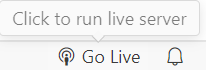

### Environnement

##### Live Server **5.7.9**
>Last Updated 2024-12-04, 18:57:58
>Identifier `ritwickdey.lives`
##### Visual Studio Code **Latest version**

---
### Procédure

Cloner le repos
```bash
git clone https://github.com/Evin06/324-TS2-Portfolio.git
```

Naviguer jusqu'au bon répertoire
```bash
cd Projet/pages
```

Lancer *Live Server* en cliquant sur **index.html**


